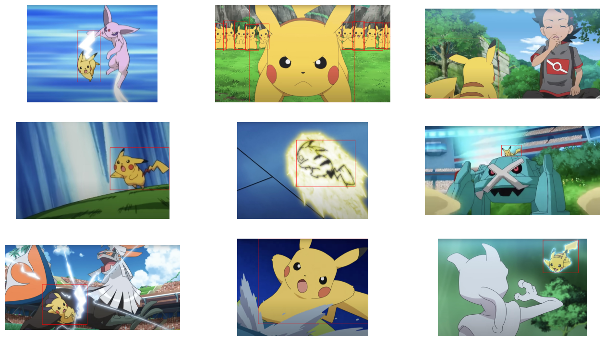

# Pikachu Dataset

This directory contain Pikachus. Lots and lots and lots of pikachus from different internet sources, different youtube videos, in a lot of different backgrounds. To train a neural network to find pikachus, you need to give it a lot of pikachus with labelled bounding boxes or segmented pixels.

Some of the code implementations will require downloading dataset in their own sub-directory for ease of use. So, the sole purpose of this directory is to provide a way to explore the complete dataset while each of the code sub-directory will have instructions about how to get data for its own training purposes.

The images are divided into `/training` and `/validation` directories for ease of viewing. Further sections desribe how the fetch the images to your local environment and use the provided `jupyter notebook` to visualize them.

## Samples Images

<div style="text-align:center">

</div>

## How to get the data

The data is stored on my dagshub repo [here](https://dagshub.com/iamrajdeep1008/Wheres-My-Pikachu) and is maintained using [dvc](https://dvc.org/) for ease of use and to keep the repository's size small. To fetch the data, first install dvc and then from the `dataset` directory of the project, run this command:

```
dvc pull
```

After that you can refer to `eda.ipynb` notebook which will let you through the process of loading images and using the bounding box labels for exploratory data analysis purposes.

## Data Statistics

This dataset contain a total of **208 images** with corresponding labels in YOLO data format (refer to [this](https://albumentations.ai/docs/getting_started/bounding_boxes_augmentation/#yolo) to know more about this format if this is new to you). The images were labelled using [LabelStudio](https://labelstud.io/) and pictures can have more than 1 label since there are a few images with a lot of pikachus in them.

It is splitted into 2 folders, `training` and `validation`, each containing `images` and `labels` folders. Split details:

**Training**: 168 images

**Validation**: 40 images

## Additional comments about the Data

- Most of the bounding boxes look a lot bigger than pikachu's body. This is due to the fact that pikachus have a tail attached to them and we definitely don't want our models to recognize tailless pikachus.
- In a lot of images, when a pikachu is using `Thunderbolt` or `Irontail` attack, the body or the tail looks very bright.
- Since this dataset is small, I'll strongly suggest using image augmentation while working.

## Disclaimer

I do not own any of the images included in this collection. All images are the property of their respective owners. The collection and labeling of these images have been done for personal use only, without any intention of copyright infringement or commercial benefit.
